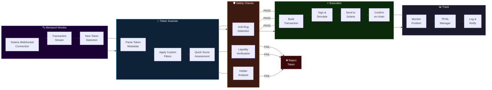
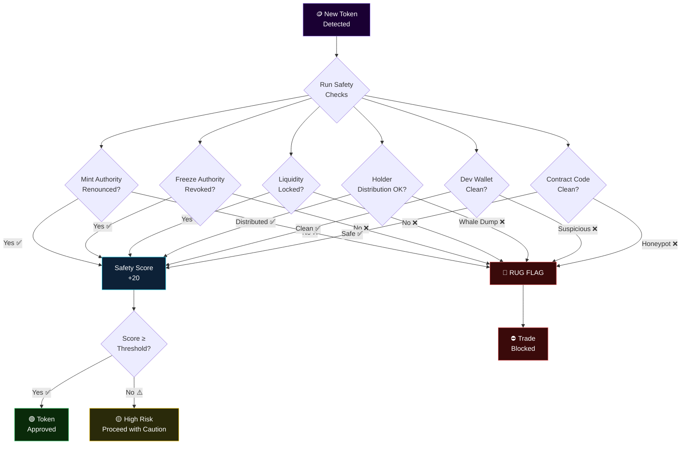
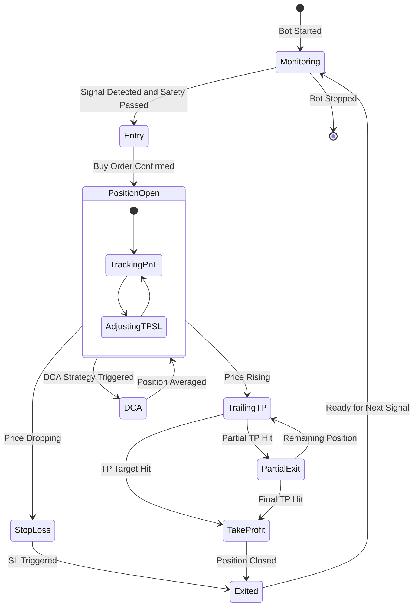
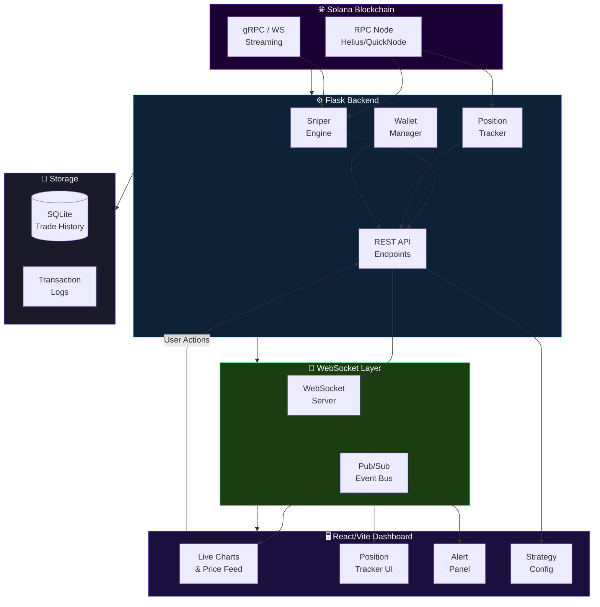

<!-- CAPSULE-RENDER HEADER -->


<!-- TYPING SVG -->
<div align="center">
  <a href="https://git.io/typing-svg">
    
  </a>
</div>

<br/>

<!-- BADGES -->
<div align="center">

[](https://solana.com/)
[](https://flask.palletsprojects.com/)
[](https://vitejs.dev/)
[](https://nodejs.org/)
[](./LICENSE)

</div>

<p align="center">
  <a href="https://github.com/mulkymalikuldhrs/SolSniperX/blob/master/README.md">English</a> |
  <a href="https://github.com/mulkymalikuldhrs/SolSniperX/blob/master/README_id.md">Bahasa Indonesia</a> |
  <a href="https://github.com/mulkymalikuldhrs/SolSniperX/blob/master/README_zh.md">中文</a>
</p>

---

## Overview

**SolSniperX** is a Solana memecoin sniper bot built with JavaScript and the Solana Web3.js SDK, featuring a **Flask backend** and **React/Vite dashboard** for real-time monitoring. Engineered for speed on the Solana blockchain, it monitors new token launches, evaluates them against configurable criteria, and executes trades in milliseconds. The bot includes anti-rug pull detection mechanisms and customizable sniping strategies for the fast-paced world of Solana memecoins.

> **⚠️ Extreme Risk Warning:** Memecoin trading involves extraordinary financial risk. This tool is built for educational and research purposes. You can lose your entire investment.

---

## Features

### Token Sniping Engine
- Real-time monitoring of new Solana token launches via Raydium, Pump.fun, and other DEXs
- Sub-second trade execution on the Solana blockchain
- Configurable buy/sell parameters (amount, slippage, gas priority)
- Multi-token concurrent sniping support

### Anti-Rug Pull Protection
- Liquidity lock verification
- Mint authority renunciation checks
- Holder distribution analysis (whale detection)
- Contract source code scanning for suspicious patterns
- Dev wallet tracking and abnormal activity alerts

### Smart Filtering
- Customizable token filters (name, symbol, metadata patterns)
- Social signal integration (Twitter mentions, Telegram activity)
- Liquidity pool minimum thresholds
- Age-based filtering to avoid stale tokens

### Trade Management
- Automatic take-profit and stop-loss execution
- Trailing stop functionality
- DCA (Dollar Cost Averaging) strategies
- Portfolio tracking with P&L calculations
- Real-time transaction logging

### Dashboard and Monitoring
- Live wallet balance and position tracking
- Transaction history with detailed analytics
- Performance metrics and win/loss ratios
- Alert system for notable events

---

## Visual Architecture

> Interactive diagrams showing sniping flow, anti-rug detection, trade management, and real-time dashboard architecture.

### Sniper Event Loop



### Anti-Rug Detection Flow



### Trade Management — Entry to Exit



### Real-Time Dashboard Architecture



---

## Honest Notes

> **Please read carefully before using this software:**

- **Extreme Financial Risk** — Memecoin trading can result in the loss of your entire investment. This is not a guaranteed profit system. Most memecoins go to zero.
- **Anti-Rug ≠ Rug-Proof** — The anti-rug pull detection significantly reduces risk but **cannot eliminate it**. Sophisticated rug pulls may bypass detection. Always assume risk.
- **Educational/Research Only** — This bot is developed as an educational tool to study Solana DeFi mechanics, MEV strategies, and automated trading systems. It is not financial advice.
- **Network Dependency** — Performance depends on Solana network conditions, RPC node speed, and regional latency. Results vary significantly based on infrastructure.
- **Smart Contract Risk** — Interacting with unaudited smart contracts (which memecoins are) always carries risk of exploits and bugs.
- **No Refunds, No Guarantees** — This is open-source software provided as-is. The authors are not responsible for any financial losses.

---

## Quick Start

### Prerequisites
- Node.js 20+
- A Solana wallet with SOL for trading
- A dedicated RPC endpoint (Helius, QuickNode, or Triton recommended)
- Basic understanding of Solana DeFi and memecoin markets

### Installation

```bash
# Clone the repository
git clone https://github.com/mulkymalikuldhrs/SolSniperX.git
cd SolSniperX

# Install dependencies
npm install

# Copy and configure environment
cp .env.example .env
```

### Configuration

Edit `.env` with your settings:
```env
# Wallet
PRIVATE_KEY=your_base58_private_key

# RPC
SOLANA_RPC_URL=https://api.mainnet-beta.solana.com
WS_URL=wss://api.mainnet-beta.solana.com

# Trading
BUY_AMOUNT_SOL=0.01
SLIPPAGE_BPS=500
PRIORITY_FEE_LAMPORTS=100000

# Anti-Rug
MIN_LIQUIDITY_SOL=5
CHECK_MINT_RENOUNCED=true
MAX_HOLDER_PERCENT=10

# Strategy
TAKE_PROFIT_PERCENT=100
STOP_LOSS_PERCENT=30
```

### Running

```bash
# Start the sniper bot
npm run start

# Start with dashboard
npm run start:dashboard

# Dry-run mode (no real trades)
npm run start:dry
```

---

## Project Structure

```
SolSniperX/
├── backend/
│   ├── src/             # Python Flask backend
│   │   ├── services/    # Trading, Monitoring, AI, Watchdog
│   │   ├── routes/      # REST API & WebSocket endpoints
│   │   ├── database/    # SQLite persistence
│   │   └── utils/       # DB and response helpers
│   ├── tests/           # Backend test suite
│   └── requirements.txt # Python dependencies
├── frontend/
│   ├── src/             # React/Vite dashboard
│   │   ├── components/  # UI, Layout, AI components
│   │   ├── contexts/    # API, WebSocket, Theme contexts
│   │   └── pages/       # Dashboard, Trading, Scanner pages
│   ├── package.json     # Frontend dependencies
│   └── vite.config.js   # Vite configuration
├── auto_trader_config.json # Strategy configuration
├── start_dev.sh         # Integrated startup script
└── verify_v3_3_0.py     # E2E system verification
```

---

## Contributing

1. **Fork** the repository
2. Create a feature branch (`git checkout -b feature/amazing-feature`)
3. Commit your changes (`git commit -m 'Add amazing feature'`)
4. Push to the branch (`git push origin feature/amazing-feature`)
5. Open a **Pull Request**

> **Note:** PRs that add features for market manipulation, front-running retail users, or exploit-specific vulnerability targeting will not be accepted.

---

## Disclaimer

**THIS SOFTWARE IS PROVIDED FOR EDUCATIONAL AND RESEARCH PURPOSES ONLY.** It is not financial advice, investment advice, or trading advice. Cryptocurrency trading, particularly memecoin trading, carries extreme risk including total loss of capital. The authors and contributors assume **no liability** for any financial losses, damages, or legal consequences arising from the use of this software. Use at your own risk. Always comply with your local laws and regulations regarding cryptocurrency trading.

---

## License

This project is licensed under the **MIT License** — see the [LICENSE](./LICENSE) file for details.

---

## Author

<div align="center">

**Mulky Malikul Dhaher**

[](https://github.com/mulkymalikuldhrs)
[](mailto:mulkymalikudhr@mail.com)

</div>

---

<!-- FOOTER BANNER -->

